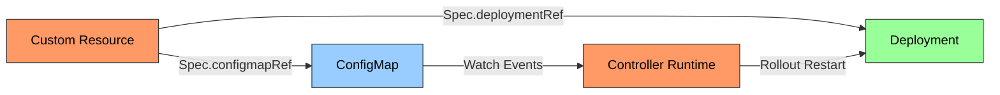

# config-reload
A custom Kubernetes controller that triggers a rollout of the referenced Deployment when the referenced ConfigMap is updated.

## Architecture


## Progect Structure
```bash
.
├── apis
│   ├── apis.go                             # Main API registration
│   ├── configreload        
│   │   └── v1
│   │       ├── groupversion_info.go        # API group and version info
│   │       ├── resource.go                 # Custom resource definition
│   │       └── zz_generated.deepcopy.go
│   └── generate.go                         # Code generation directives
├── crds                                    # Generated CRD manifests
│   └── configreload.example.com_configreloads.yaml
├── example-configmap.yaml
├── example-configreload.yaml
├── example-deployment.yaml
├── go.mod                                  # Go module definition
├── go.sum                                  # Go module checksums
├── main.go                                 # Controller implementation
└── README.md
```

## Prerequisites

- Go 1.24.2 or later
- Access to a Kubernetes cluster
- kubectl configured to access your cluster

## Setup and Installation

### 1. Clone and Setup Dependencies

```bash
git clone <repository-url>
cd config-reload
go mod tidy
```

### 2. Generate CRDs

Generate the Custom Resource Definitions from the Go types:

```bash
go generate ./...
```

### 3. Install CRDs in Your Cluster

Apply the generated CRDs to your Kubernetes cluster:

```bash
kubectl apply -f crds/
```

Verify the CRDs are installed:

```bash
kubectl get crds | grep configreloads
```

### 4. Run the Controller

Start the controller locally:

```bash
go run main.go
```

## Usage

### Apply ConfigMap and Deployment

```bash
kubectl apply -f example-configmap.yaml
kubectl apply -f example-deployment.yaml
```

### Apply the ConfigReload resource:

```bash
kubectl apply -f example-configmap.yaml
```

### Check the status of the ConfigReload

```bash
kubectl get configreloads
```
Example output:

```bash
NAME                   LAST DEPLOYMENT ROLLOUT   LAST CONFIGMAP VERSION
example-configreload   2025-06-23T10:11:14Z      548

```

The ConfigReload status shows two parameters:

- LAST DEPLOYMENT ROLLOUT: Timestamp of the last rollout of the linked Deployment
- LAST CONFIGMAP VERSION: Version of the ConfigMap used by the controller to determine whether to trigger a rollout


### Trigger a Deployment Rollout
To trigger a rollout, edit the ConfigMap:

```bash
export KUBE_EDITOR=vim      # Set if not already configured

kubectl edit configmap my-configmap

```
Modify any key-value pair in the ConfigMap. After saving the changes, the controller will automatically trigger a rollout.

Verify the new status:

```bash
kubectl get configreloads
```
Example output after update:

```bash
NAME                   LAST DEPLOYMENT ROLLOUT   LAST CONFIGMAP VERSION
example-configreload   2025-06-23T10:34:31Z      2722

```